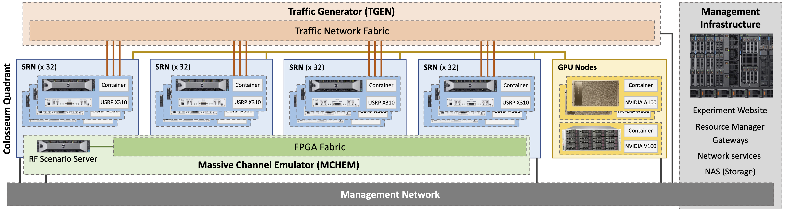

=============
About Colosseum
=============

Colosseum is the world's largest RF emulator designed to support research and development of large-scale, next generation radio network technologies in a repeatable and highly configurable RF environment. It combines 128 Standard Radio Nodes (SRNs) with a Massive digital Channel Emulator (MCHEM) backed by an extensive FPGA routing fabric.

Hardware Architecture
--------------------

Each SRN provides a platform for Software Defined Radio and Machine Learning applications with two key hardware components:

* A Dell R730 Server with an NVIDIA K40M GPU
* An Ettus Research USRP X310 Software-defined Radio equipped with a XILINX Kintex 7 FPGA

   Figure 1: Colosseum architecture showing the interconnection between SRNs and MCHEM

The MCHEM facilitates real-world wireless RF channel emulation between the SRNs and can emulate fading, multipath, etc., for up to 256 x 256 independently customizable channels. This allows for large scale RF testing with up to 256 independent radio nodes each with powerful computational capabilities.

Key Capabilities
---------------

As an RF testbed, Colosseum can be utilized to:

* Emulate multiple operational environments including a 1 sq. km open field, a dense urban city, a suburban shopping mall, a desert, or anything in-between
* Emulate in real-time multipath and fading effects with high-fidelity ray-tracing
* Support high-fidelity and large-scale research on waveforms, protocols at all layers, networked applications, jamming and security, MIMO, and beamforming
* Provide full-stack repeatable environment (from RF to application layer)
* Carry out large scale testing, up to 256 radio nodes with 256x256 configurable channels
* Support cellular networks (4G, 5G), IoT, cognitive radio, ad hoc networks, edge computing, and cloud RAN research
* Implement Machine Learning algorithms in different wireless communications techniques
