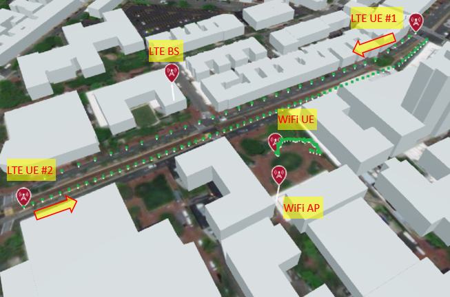
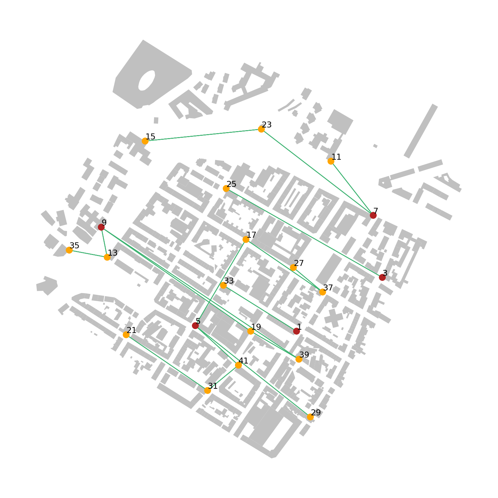
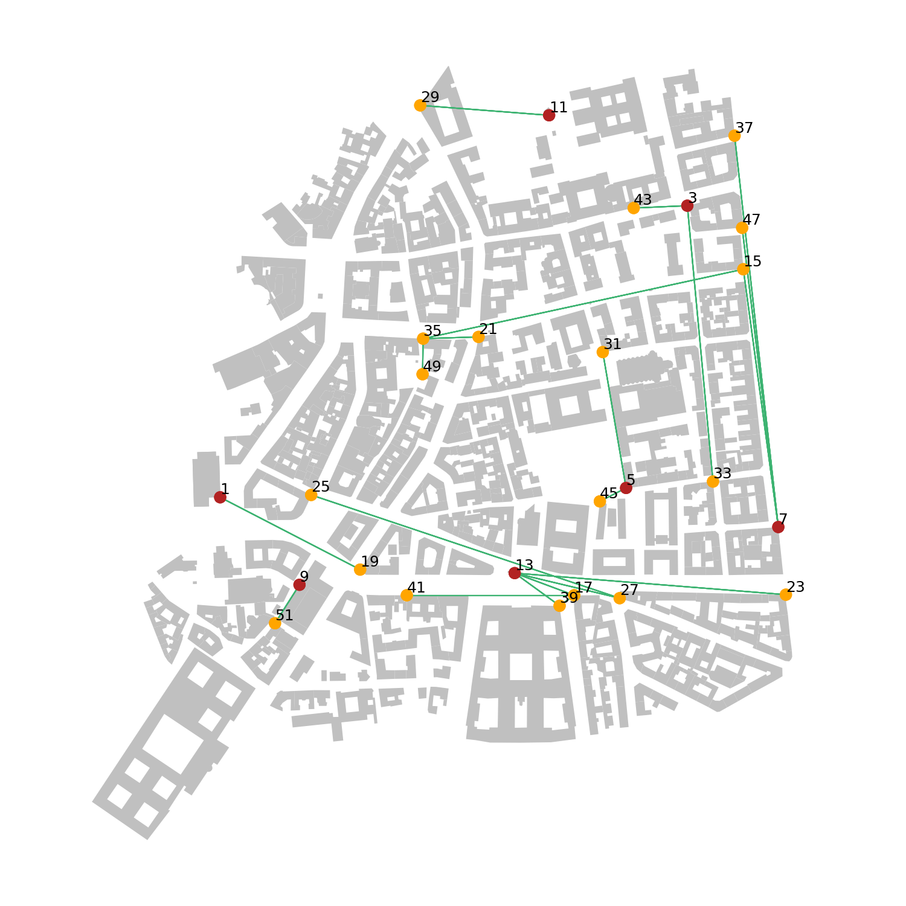
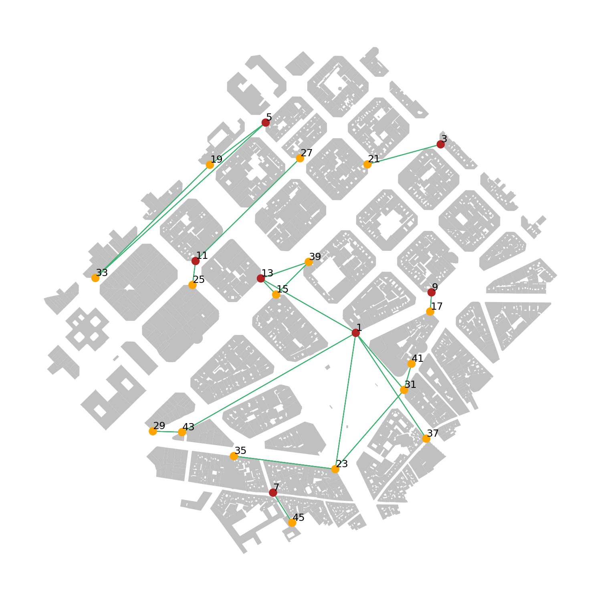
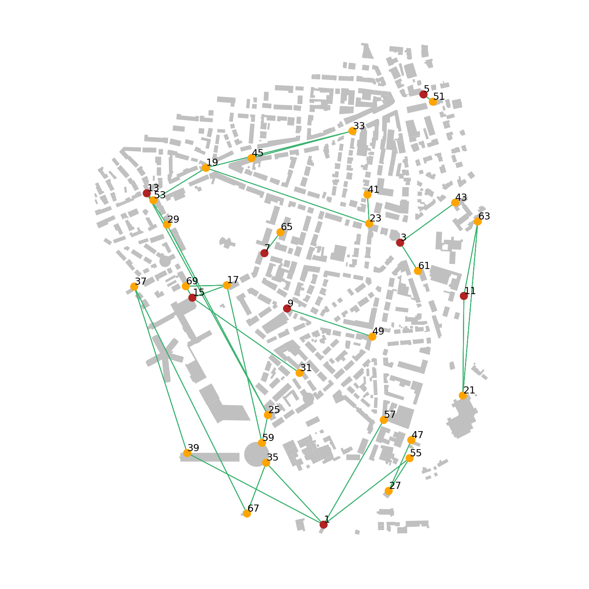

=====================
About Colosseum
=====================

Overview
--------

Colosseum is the world's largest RF emulator designed to support research and development of large-scale, next generation radio network technologies in a repeatable and highly configurable RF environment. It combines 128 Standard Radio Nodes (SRNs) with a Massive digital Channel Emulator (MCHEM) backed by an extensive FPGA routing fabric.

Each SRN provides a platform for Software Defined Radio and Machine Learning applications with two key hardware components:

* A Dell R730 Server with an NVIDIA K40M GPU
* An Ettus Research USRP X310 Software-defined Radio equipped with a XILINX Kintex 7 FPGA

The MCHEM facilitates real-world wireless RF channel emulation between the SRNs and can emulate fading, multipath, etc., for up to 256 x 256 independently customizable channels. This allows for large scale RF testing with up to 256 independent radio nodes each with powerful computational capabilities.

Accessibility and Features
--------------------------

Colosseum is remotely accessible to users and operates 24/7/365. Users can reserve Colosseum resources through a simple web interface. Emulation jobs can be done either:

* Manually in an interactive session during the scheduled time
* As batch jobs that run automatically per user's instructions

As an RF testbed, Colosseum can be utilized to:

* Emulate multiple operational environments including a 1 sq. km open field, a dense urban city, a suburban shopping mall, a desert, or anything in-between
* Emulate in real-time multipath and fading effects with high-fidelity ray-tracing
* Support high-fidelity and large-scale research on waveforms, protocols at all layers, networked applications, jamming and security, MIMO, and beamforming
* Provide full-stack repeatable environment (from RF to application layer)
* Carry out large scale testing, up to 256 radio nodes with 256x256 configurable channels
* Support cellular networks (4G, 5G), IoT, cognitive radio, ad hoc networks, edge computing, and cloud RAN research
* Implement Machine Learning algorithms in different wireless communications techniques such as spectrum sharing, dynamic spectrum access, extraction of signal intelligence and optimized routing, by providing built-in powerful computational resources

Colosseum provides users with preconfigured and ready-to-use LXC containers for basic testing. Users can customize these containers based on their needs to develop and implement their own radio codes. These customized container images can be uploaded to the Colosseum servers, and users may choose to load the default or customized containers onto the SRNs during their reserved session.

How to Sign Up
-------------

If you are interested in becoming a Colosseum user, you can request for a new team and account via this `form <https://docs.google.com/forms/d/e/1FAIpQLScHZ7gNyO4TB8b2xXPnbvPCSzGv22i0NREQ7p2XZyhF-dNQWA/viewform>`_

Colosseum Webinars
-----------------

Colosseum offers introductory webinars covering various aspects of the platform, including:

1. **Introduction to Colosseum** - A high-level overview of the Colosseum architecture and its role in wireless research

2. **Colosseum Use Cases** - Description of key research use cases including WiFi, Cellular/5G, Open RAN, Mesh/Ad Hoc Networks/UAVs, Spectrum Sharing, MIMO/Beamforming, Lora/LPWAN, and AI in wireless
   (`Video <https://www.youtube.com/watch?v=vNKbr19VdWM&list=PLyPwVNte-Wvqovf58LWsfmvWLHQ-dGGQz&index=2>`_)

3. **From Colosseum to PAWR** - Discussion on migrating Colosseum experiments to PAWR platforms
   (`Video <https://www.youtube.com/watch?v=H1xT1fv3nnc&list=PLyPwVNte-Wvqovf58LWsfmvWLHQ-dGGQz&index=3>`_)

4. **Colosseum Scenarios and Traffic** - Deep dive into Colosseum RF and Traffic emulation scenarios
   (`Video <https://www.youtube.com/watch?v=kduNeOxWorw&list=PLyPwVNte-Wvqovf58LWsfmvWLHQ-dGGQz&index=4>`_)

5. **How to use Colosseum: First Time Users** - Live demonstration of running a basic experiment for first-time users
   (`Video <https://www.youtube.com/watch?v=Ct1m9aDQhwc&list=PLyPwVNte-Wvqovf58LWsfmvWLHQ-dGGQz&index=5>`_)

6. **Colosseum File Proxy and Container Creation** - Accessing logs in the file-proxy server and preparing customized LXC containers
   (`Video <https://www.youtube.com/watch?v=HmZlTQ0xL1E&list=PLyPwVNte-Wvqovf58LWsfmvWLHQ-dGGQz&index=6>`_)

7. **Colosseum Events and Community** - Review of current and future plans for Colosseum events and community outreach
   (`Video <https://www.youtube.com/watch?v=Xn1zB3b_rOc&list=PLyPwVNte-Wvqovf58LWsfmvWLHQ-dGGQz&index=7>`_)

Recorded videos and presentation files for each session are available on the Colosseum website.

Frequently Asked Questions
-------------------------

Hardware and Computation Capabilities
~~~~~~~~~~~~~~~~~~~~~~~~~~~~~~~~~~~~

**Q: Is it possible to run/install packages using the internet?**

A: It is possible to set up appropriate proxies and you can access the wide internet, but it is currently restricted. We encourage users to install software on their local system due to reasons including using Colosseum resources primarily for experiments and not being limited by Colosseum reservation time.

**Q: How much storage is available for each team on the NAS server?**

A: There are quotas for each team, it can be specified according to your needs. At the moment the quota is 50 gigabytes per team.

**Q: Are the SRNs synchronized at the RF TX port to build the MIMO model using multiple SRNs?**

A: Yes, they are synchronized through Octoclocks (clock/PPS signal).

**Q: For the mMIMO case, what is the maximum number of time and phase coherent antennas/radios?**

A: The current maximum is 32 SDRs.

**Q: I assume you can build a MIMO channel model using multiple SRNs, especially for more than 2 layers, is this right?**

A: Yes, you can build a MIMO system using different SRNs.

**Q: Is there any guideline regarding the maximum sample rate that can be supported by the host (assuming default FPGA images at USRPs)?**

A: Each USRP has an independent host/server, so your only bottleneck is the speed of the single host. Also see: `Ettus X310 Kit <https://www.ettus.com/all-products/x310-kit/>`_.

**Q: What are the available bandwidth sub bands? Is it possible to make use of 5G bands 3.4Ghz and 3.5Ghz? Are 30GHz available too?**

A: Any frequency supported by UBX daughterboards can be used for your experiment.

**Q: Do users have full access to UHD settings in each USRP?**

A: Yes, you can basically flash the FPGA, but access is only through JTAG and power cycling is not permitted.

**Q: Can we physically access the SDRs to perform some real measurements?**

A: Users have full access to the SDR software and the host server. At this time users do not have "physical" access to the SDR.

**Q: Can we account for the "true" hardware impairments of the RF front-end or is this a baseband-in-the-loop simulation?**

A: Yes, the signal transmitted travels through a physical radio's pipeline which allows for true hardware impairments. Everything is Colosseum is "real", so you can emulate from traffic to waveform, including all the real-world imperfections you get in a real system.

**Q: What are the constraints of each SDR? E.g., what is the number of Tx/Rx antennas per supported per node? What is the range of operating frequency/bandwidth? Are there any constraints on the frequency range?**

A: Each SDR is an X310, with 2 daughterboards. So all the constraints are the same as the X310. See `Ettus X310 Kit <https://www.ettus.com/all-products/x310-kit/>`_.

**Q: What is the clock/sample rate in the FPGA channel emulator?**

A: MCHEM samples at 200 MS/s, see `X300/X310 Documentation <https://kb.ettus.com/X300/X310>`_.

RF Emulation Scenarios and Capabilities
~~~~~~~~~~~~~~~~~~~~~~~~~~~~~~~~~~~~~~

**Q: Can channel emulation happen in the RF or it happens in the "baseband" and will be fed back into RF?**

A: Channel emulation happens in baseband.

**Q: Is it possible to simulate phased array antennas for directional mmWave research?**

A: Technically it is possible to simulate phased array antennas but not at mmWave.

**Q: How many taps can be specified for the channel model?**

A: It is 512 taps for each link. You can emulate up to 256x256 channels. You can specify taps for each individual link.

**Q: Does the 4-tap filter emulator incorporate both the delay due to path loss and any small-scale fading?**

A: The 4 taps are complex numbers and can be used to model any channel effect (path-loss, fading, multi-path, etc…). Each path delay is accounted for. Small-scale fading can be emulated according to your specific scenario (for example, with a ray tracer).

**Q: Is Wi-Fi unicast working (i.e., ACKs return in time?)**

A: You can always use the channel as a feedback to get the IDs. No base container has this capability currently, but users can implement it in their own codes.

**Q: How are the channel models for the 5G wireless environments modeled (in Rome, Boston, etc.)? Are they based on actual measurements/mathematical models/raytracing, etc?**

A: They are dependent on the scenarios. There are scenarios in development based on ray tracing and it is certainly possible to be able to be based on actual measurements/mathematical models.

**Q: Does Colosseum support hybrid terrestrial-satellite communication?**

A: It does support hybrid aerial communications. The delay that can be modeled by Colosseum is limited to what you would see in a scenario with 1 km of distance. As of now, satellite communication is not supported by Colosseum but maybe possible in the future.

**Q: Can users design their own scenarios?**

A: As of now, users are only provided set scenarios and are not able to design their own scenarios. We are open to working with users to create a scenario if the existing scenarios do not satisfy the users' needs.

**Q: Can users create their own custom protocol stack? (from APP to PHY)**

A: Yes, users have freedom to create a fully customized protocol stack.

**Q: What is the end to end (TX process to RX process) delay?**

A: Colosseum generates a real wireless signal over the SDR which is passed through a wire and the wire's propagation delay in near real time. It is as fast a radio can process an RF signal and as fast as the propagation can happen. We account for waveform propagation delay as well.

**Q: Are the SDRs connected 1-to-1 or is there a multi-path component in RF analog also?**

A: The SDRs are connected to the channel emulator physically. The channel matrix that we enter at the emulator takes into account multiple signals. On the receiver side, the receiver takes in the intended transmission and transmission interference from the rest of the other transmitters which adds to the complexity capabilities of Colosseum 4-tap model.

**Q: How realistic is it to only have 4 non-zero taps?**

A: We had to make a compromise between feasibility/cost and fidelity. Colosseum supports up to 512 taps per link. 4 taps is a good compromise between complexity and accuracy. This is something we inherited from DARPA/APL. In most cases the system so far has been used with path loss and propagation delay only (no multi path). We are developing a pipeline to approximate propagation profiles generated with ray tracers with a sparse 512-tap filter with 4 nonzero taps. Feedback from the community is very much appreciated. Introducing additional taps will require substantial changes in the channel emulator. Basically, it is the FPGA space needed to emulate the entire 256x256 mesh.

**Q: What about having 4 non-zero taps at the mmWave level?**

A: mmWave will be a new, redesigned quadrant with longer channels and only 16x16 mesh.

**Q: How fast are the taps updated?**

A: Scenarios are generated with 1 second resolution, then interpolation occurs, and resolution is one millisecond. So, for every millisecond we update the channel information.

**Q: The channel taps can be changed, but is the number of taps fixed?**

A: The number of taps is always fixed but they change every 1 ms. Scenarios can be made where the channel will update at various speeds or to be fixed.

**Q: Is it possible to reduce the total number of taps from 512 to something like 64-80 while each tap can be populated?**

A: Only 4 taps can be non-zero. The 4 taps are generated according to your RF scenario and are completely customizable. They are stored inside Colosseum and are automatically retrieved and processed whenever you launch a reservation. We are working on releasing a general tool that can generate the 4 taps given coordinates of nodes and the location of the region where they are placed. To enter these taps implies making a new scenario. This feature is not available to general users as of now as a directly accessible capability but we can work with individual teams on scenario building if the existing scenarios do not satisfy the users' needs.

Colosseum Containers
~~~~~~~~~~~~~~~~~~~

**Q: What is the process for using specific packages for custom experiments?**

A: A custom LXC container must be created and all packages and changes must be made on your local machine and then saved to the image and uploaded to the experiment's reservation website.

**Q: Would the container management framework support something like Kubernetes or Kubevirt?**

A: Not right now, but we are planning on supporting them.

**Q: Can users have a snapshot of the image within the container using the Colosseum CLI?**

A: Yes, and it will be saved in the images folder of your team directory.

**Q: Do the containers have access to the internet? Or do I have to download the container to install software?**

A: By default, containers do not have access to the internet. The best practice to install new software is by downloading the base image on your computer and modify it as you wish, and then upload it back to Colosseum.

**Q: What is usually included in the container exactly? Everything running on SRN?**

A: A container includes your own code to process the incoming traffic. The base containers come with the UHD drivers, Colosseum CLI, and all other requirements needed to connect to the USRPs, the MCHEM, and other components of the system.

**Q: Has there been benchmarking done to compare the potential overhead of running code in container instead of native machine? Any implications on types of experiments supportable?**

A: LXC containers give you bare metal access to hardware. So, the overhead should be negligible. The code is running locally on the SRN host. Each SRN has its own blade server.

Legacy Scenarios Support, PAWR Integration and Future Upgrades
~~~~~~~~~~~~~~~~~~~~~~~~~~~~~~~~~~~~~~~~~~~~~~~~~~~~~~~~~~~~~~

**Q: Are you going to resurrect the mandated outcomes and collaboration channel from the SC2 competition?**

A: For the time being, we are not working on resurrecting the mandated outcomes. The feature is archived at the moments as the current focus is not for competition-based experiments.

**Q: To what extent can Colosseum currently serve as a stepping-stone to in-field experimentation on the existing PAWR platforms?**

A: We have onboarded a large set of lead users including participants from the DARPA SC2 competition and other lead user communities with prior experience with Colosseum which include some NSF researchers. These teams developed the containers ansible tool chains to extend the containers that we use for Colosseum and that can be used for existing PAWR platforms. While the process is still being optimized, there is capability for instantiating the Colosseum LXC containers on the PAWR compute fabric that will allow them to connect to the SDRs that are available for PAWR.

**Q: Are there any in-field PAWR scenarios currently modeled in Colosseum?**

A: Colosseum has 2 scenarios from the PAWR platform that were based on measurement campaigns that would be run statically and remotely by the Northeastern team to develop. Recently, the PAWR team itself has run a measurement campaign and we will be releasing to the public, the data set at multiple frequencies. These frequencies (CBRS and 2.5) are currently being annotated and will be released to the community.

Selected Scenarios
------------------

Colosseum offers a variety of RF scenarios for different research purposes:

LTE and Wi-Fi Coexistence Scenario (50005)
~~~~~~~~~~~~~~~~~~~~~~~~~~~~~~~~~~~~~~~~~~

Overview - High-Level Description
^^^^^^^^^^^^^^^^^^^^^^^^^^^^^^^^^

+-------------------+------------------------------------------------+
| Label             | Value                                          |
+===================+================================================+
| Version           | Formal                                         |
+-------------------+------------------------------------------------+
| RF ID             | 50005                                          |
+-------------------+------------------------------------------------+
| RF Description    | 50005 (LTE-WiFi with mobility scenario + 70dB) |
+-------------------+------------------------------------------------+
| Noise power BW    | 20 MHz                                         |
+-------------------+------------------------------------------------+
| Usable BW for     | 80 MHz                                         |
| transmissions     |                                                |
+-------------------+------------------------------------------------+
| Traffic ID        | 500050                                         |
+-------------------+------------------------------------------------+
| Traffic           | Default (WiFi: Video, LTE UE1: VOIP,           |
| Description       | LTE UE2: Vehicle Safety service)               |
+-------------------+------------------------------------------------+
| Center Frequency  | 1.0 GHz                                        |
+-------------------+------------------------------------------------+
| Number of Nodes   | 5                                              |
+-------------------+------------------------------------------------+
| Duration          | 70 seconds                                     |
+-------------------+------------------------------------------------+

Narrative
^^^^^^^^^

This scenario has been intended to study the interference of the WiFi IEEE802.11ac network on the LTE mobile UE with ISM band carrier aggregation in an urban campus scenario. In this scenario, a portion of the Northeastern University Boston campus is considered with WiFi coverage that serves students and staff with the Internet service. 

In addition, there are two mobile LTE UEs in vehicles that are passing the campus area through Huntington avenue moving between Gainsborough street and the Forsyth street intersection with a set velocity.

The LTE network can operate both in the dedicated licensed band as well as in an unlicensed ISM band in coexistence with the WiFi network. The LTE base station (eNodeB) is a small cell, mounted on a building wall, and the outdoor WiFi access point is mounted on the rooftop of the Ell Hall building. 

The green dots represent the sample of channels for the three mobile users including the WiFi users located in the campus Krentzman quadrangle. The arrangement of the LTE eNodeB and WiFi AP in this scenario demonstrates the combination of Line of Sight (LOS) and Non-Line of Sight (NLOS) communication channel states with respect to the location of the mobile users along their trajectory.

   Figure 1: LTE-WiFi coexistence scenario in the Northeastern Boston campus wireless environment showing the positions of LTE BS, LTE UEs, WiFi AP, and WiFi UE.

The details for the mobility type, pattern and velocity can be found in the tables below. 

.. container:: horizontal-figures

   .. figure:: _static/5005/5005_table1.png
      :width: 200px
      :alt: Scenario table 1
   
   .. figure:: _static/5005/5005_table2.png
      :width: 200px
      :alt: Scenario table 2
   
   .. figure:: _static/5005/5005_table3.png
      :width: 200px
      :alt: Scenario table 3

Node Placement
^^^^^^^^^^^^^^

The table below indicates which node id's map to which label in the physically simulated wireless environment:

+------------+---------------+
| Node ID #  | Node Name     |
+============+===============+
| 1          | LTE BS        |
|            | (eNodeB)      |
+------------+---------------+
| 2          | WiFi AP       |
+------------+---------------+
| 3          | LTE UE #1     |
+------------+---------------+
| 4          | LTE UE #2     |
+------------+---------------+
| 5          | WiFi UE       |
+------------+---------------+

Scenario Parameters
^^^^^^^^^^^^^^^^^^^

+------------------------+----------------------------------------+
| Label                  | Value                                  |
+========================+========================================+
| Modeled Location       | Northeastern University, Boston campus |
+------------------------+----------------------------------------+
| Scenario Duration      | 70 [S]                                 |
+------------------------+----------------------------------------+
| Scenario Repeats       | True                                   |
| at End?                |                                        |
+------------------------+----------------------------------------+
| Number of Nodes        | 5                                      |
+------------------------+----------------------------------------+
| Number of Teams        | NA                                     |
+------------------------+----------------------------------------+
| Government Controlled  | NA                                     |
| Radios                 |                                        |
+------------------------+----------------------------------------+
| Ray-tracing simulation | 5.8 GHz                                |
| frequency              |                                        |
+------------------------+----------------------------------------+
| Emulation Center       | 1 GHz                                  |
| Frequency              |                                        |
+------------------------+----------------------------------------+
| Max Scenario Bandwidth | 80.0 MHz                               |
+------------------------+----------------------------------------+
| SRN Separation Range   | NA                                     |
+------------------------+----------------------------------------+
| Node Mobility          | LTE UEs: Route, WiFi UE: Random Way    |
|                        | Point (RWP)                            |
+------------------------+----------------------------------------+
| Link Reciprocity       | NA                                     |
+------------------------+----------------------------------------+
| Self Channel (Gain to  | only reflections                       |
| Own Antenna)           |                                        |
+------------------------+----------------------------------------+
| Antenna Pattern        | Isotropic                              |
+------------------------+----------------------------------------+
| Number of Antennas     | 2 (identical channel)                  |
| Per Node               |                                        |
+------------------------+----------------------------------------+
| Antenna Spacing        | NA                                     |
+------------------------+----------------------------------------+

See the `scenario manual <_static/docs/5005_manual.pdf>`_ for more information on how to use MATLAB to build RF scenarios for Colosseum.

Integrated Access and Backhaul (IAB) Scenarios
~~~~~~~~~~~~~~~~~~~~~~~~~~~~~~~~~~~~~~~~~~~~~~

Narrative
^^^^^^^^^

This RF scenarios emulates the wireless environment in different densely urban areas around Europe. Specifically in Florence, Milan, Barcelona and Luxemburg. In this scenarios we deploy around 25 IAB nodes. 

Since the current IAB-like implementation available needs two different SRNs for each IAB node, the scenario doubles every node, by creating two radio nodes in the same location. This scenario is intended to test large scale IAB-deployments, but by ignoring the doubled nodes it can be used to experiment any kind of mobile network.

Node Placement
^^^^^^^^^^^^^^

For the placement of the gNBs an heuristic developed by Gemmi et Al. has been used. The heuristic tries to find the combination of k gNBs location among the perimeter of the buildings, that maximizes the Line-of-Sight coverage towards public roads. More details are available in the paper.

Radio Environment Modelling
^^^^^^^^^^^^^^^^^^^^^^^^^^^

For the generation of this scenario we first have computed the visibility graph among all the gNB locations. This allowed us to discern LoS links from NLoS links. Afterwards we have applied the Urban Micro (UMi) channel model documented by ETSI in the technical report TR38.901. 

Finally, since Colosseum have a base pathloss of around 50dB, this value has been subtracted by the pathloss to compensate. More details on this are available in the original research: `CaST <https://ece.northeastern.edu/wineslab/papers/villa2022wintech.pdf>`_.

For each scenario, four different variations have been implemented, varying the modeled frequency (28GHz or 3.6GHz) and varying the type of link considered (only LoS links or all kind of links).

Florence, Italy
^^^^^^^^^^^^^^^

+------------------------+----------------------------------------+
| **Label**              | **Value**                              |
+========================+========================================+
| Area                   | Via di Maragliano, Florence, Italy     |
+------------------------+----------------------------------------+
| Coordinates            | 11.232E, 43.786N                       |
+------------------------+----------------------------------------+
| RF ID                  | XXXXX (28 GHz)                         |
|                        | XXXXX (28 GHz only LoS)                |
|                        | XXXXX (3.6 GHz)                        |
|                        | XXXXX (3.6 GHz only LoS)               |
+------------------------+----------------------------------------+
| Duration               | 1s, cyclable                           |
+------------------------+----------------------------------------+
| RF Description         | Single Tap, large scale                |
+------------------------+----------------------------------------+
| Center Frequency       | 1GHz                                   |
+------------------------+----------------------------------------+
| Number of Nodes        | 40 (20 IAB nodes)                      |
+------------------------+----------------------------------------+

Milan, Italy
^^^^^^^^^^^^

+------------------------+----------------------------------------+
| **Label**              | **Value**                              |
+========================+========================================+
| Area                   | Milan, Italy                           |
+------------------------+----------------------------------------+
| Coordinates            | 9.203E, 45.464N                        |
+------------------------+----------------------------------------+
| RF ID                  | XXXXX (28 GHz)                         |
|                        | XXXXX (28 GHz only LoS)                |
|                        | XXXXX (3.6 GHz)                        |
|                        | XXXXX (3.6 GHz only LoS)               |
+------------------------+----------------------------------------+
| Duration               | 1s, cyclable                           |
+------------------------+----------------------------------------+
| RF Description         | Single Tap, large scale                |
+------------------------+----------------------------------------+
| Center Frequency       | 1GHz                                   |
+------------------------+----------------------------------------+
| Number of Nodes        | 52 (23 IAB nodes)                      |
+------------------------+----------------------------------------+

Barcelona, Spain
^^^^^^^^^^^^^^^^

+------------------------+----------------------------------------+
| **Label**              | **Value**                              |
+========================+========================================+
| Area                   | Plaza de Catalunya, Barcelona, Spain   |
+------------------------+----------------------------------------+
| Coordinates            | 2.168E, 41.389N                        |
+------------------------+----------------------------------------+
| RF ID                  | XXXXX (28 GHz)                         |
|                        | XXXXX (28 GHz only LoS)                |
|                        | XXXXX (3.6 GHz)                        |
|                        | XXXXX (3.6 GHz only LoS)               |
+------------------------+----------------------------------------+
| Duration               | 1s, cyclable                           |
+------------------------+----------------------------------------+
| RF Description         | Single Tap, large scale                |
+------------------------+----------------------------------------+
| Center Frequency       | 1GHz                                   |
+------------------------+----------------------------------------+
| Number of Nodes        | 46 (23 IAB nodes)                      |
+------------------------+----------------------------------------+

Luxembourg
^^^^^^^^^^

+------------------------+----------------------------------------+
| **Label**              | **Value**                              |
+========================+========================================+
| Area                   | Parc de Merl, Luxembourg               |
+------------------------+----------------------------------------+
| Coordinates            | 6.115E, 49.60N                         |
+------------------------+----------------------------------------+
| RF ID                  | XXXXX (28 GHz)                         |
|                        | XXXXX (28 GHz only LoS)                |
|                        | XXXXX (3.6 GHz)                        |
|                        | XXXXX (3.6 GHz only LoS)               |
+------------------------+----------------------------------------+
| Duration               | 1s, cyclable                           |
+------------------------+----------------------------------------+
| RF Description         | Single Tap, large scale                |
+------------------------+----------------------------------------+
| Center Frequency       | 1GHz                                   |
+------------------------+----------------------------------------+
| Number of Nodes        | 70 (35 IAB nodes)                      |
+------------------------+----------------------------------------+

Other Available Scenarios
~~~~~~~~~~~~~~~~~~~~~~~~

Colosseum offers a wide range of other scenarios, including the following:

Base Tests 1 GHz
^^^^^^^^^^^^^^^^

* Scenario IDs: 1009, 10009, 10024
* Base scenarios used for all tests with all paths at 0dB at 1 GHz.
* Available scenarios: 1009, 10009, 10024

Cellular Scenarios
^^^^^^^^^^^^^^^^^^

* Scenario IDs: 1017 - 1036, 1041, 10042 - 10077
* Cellular scenarios with various channel characteristics and locations: Rome, Boston, Salt Lake City.
* Available scenarios: 1017, 1018, 1019, 1024, 1025, 1026, 1027, 1031, 1033, 1035, 1036, 1041, 10042, 10043, 10044, 10045, 10071, 10072, 10073, 10074, 10075, 10076, 10077, 10078, 10079

Alleys of Austin
^^^^^^^^^^^^^^^^

* Scenario IDs: 7013, 7014, 10015
* Legacy scenarios of Alleys of Austin.
* Available scenarios: 7013, 7014, 10015

SCE Qualifications
^^^^^^^^^^^^^^^^^^

* Scenario IDs: 9988 - 9991
* Legacy SCE qualifications scenarios.
* Available scenarios: 9988, 9991

Anechoic Chamber
^^^^^^^^^^^^^^^^

* Scenario IDs: 12348 - 12356
* Anechoic Chamber scenarios with different boosts and taps.
* Available scenarios: 12350, 12351, 12352, 12353, 12354, 12356

User-defined LoRa
^^^^^^^^^^^^^^^^^

* Scenario IDs: 13201 - 13205
* User-defined scenarios with LoRa.
* Available scenarios: 13201, 13202, 13203, 13204, 13205, 13206, 13207

User-Defined Other
^^^^^^^^^^^^^^^^^^

* Scenario IDs: 33001 - 33100
* Various user-defined scenarios.
* Available scenarios: 33001, 33002, 33003, 33004, 33005, 33010, 33011, 33012, 33013, 33014

Cellular Rural Small
^^^^^^^^^^^^^^^^^^^^

* Scenario IDs: 35001-35005
* Cellular Rural Small Static scenarios at different frequencies (1 GHz and 3.6 GHz).
* Available scenarios: 35001, 35002, 35003, 35004, 35005

Tampa, Florida
^^^^^^^^^^^^^^

* Scenario IDs: 43100 - 43110
* Real-field scenarios in Tampa, Florida, with mobile nodes.
* Available scenarios: 43100, 43101, 43102, 43103, 43105, 43107

Arena Digital Twin
^^^^^^^^^^^^^^^^^^

* Scenario IDs: 45001 - 45003
* Replicate of the Arena 64-antenna grid over-the-air indoor testbed.
* Available scenarios: 45001, 45002, 45003

Waikiki Beach, Honolulu
^^^^^^^^^^^^^^^^^^^^^^^

* Scenario IDs: 45101 - 45104
* Outdoor cellular scenario in Waikiki Beach, Honolulu, with BS, UEs, and a mobile ship.
* Available scenarios: 45101, 45102, 45103, 45104

Northeastern University Campus, Boston
^^^^^^^^^^^^^^^^^^^^^^^^^^^^^^^^^^^^^^^

* Scenario ID: 50005
* LTE and Wi-Fi coexistence in an outdoor location in the Northeastern Campus.

Fixed Pathloss 1 GHz
^^^^^^^^^^^^^^^^^^^^

* Scenario IDs: 51000 - 51100
* Synthetic scenarios with all paths at a fixed pathloss at 1 GHz.
* Available scenarios: 51005, 51010, 51015, 51020, 51025, 51030

0 dB Various Frequencies
^^^^^^^^^^^^^^^^^^^^^^^

* Scenario IDs: 52000 - 52100
* Base scenarios with all paths at 0dB at various center frequencies.
* Available scenarios: 52001, 52002, 52003, 52004, 52005, 52006

Channel Sounding
^^^^^^^^^^^^^^^^

* Scenario IDs: 90000 - 99100
* Channel Sounding scenarios, developed in a synthetic way to study MCHEM behavior.
* Available scenarios: 90000, 90001, 90002, 90003, 90004, 90005, 90006, 90007, 90008, 90009
