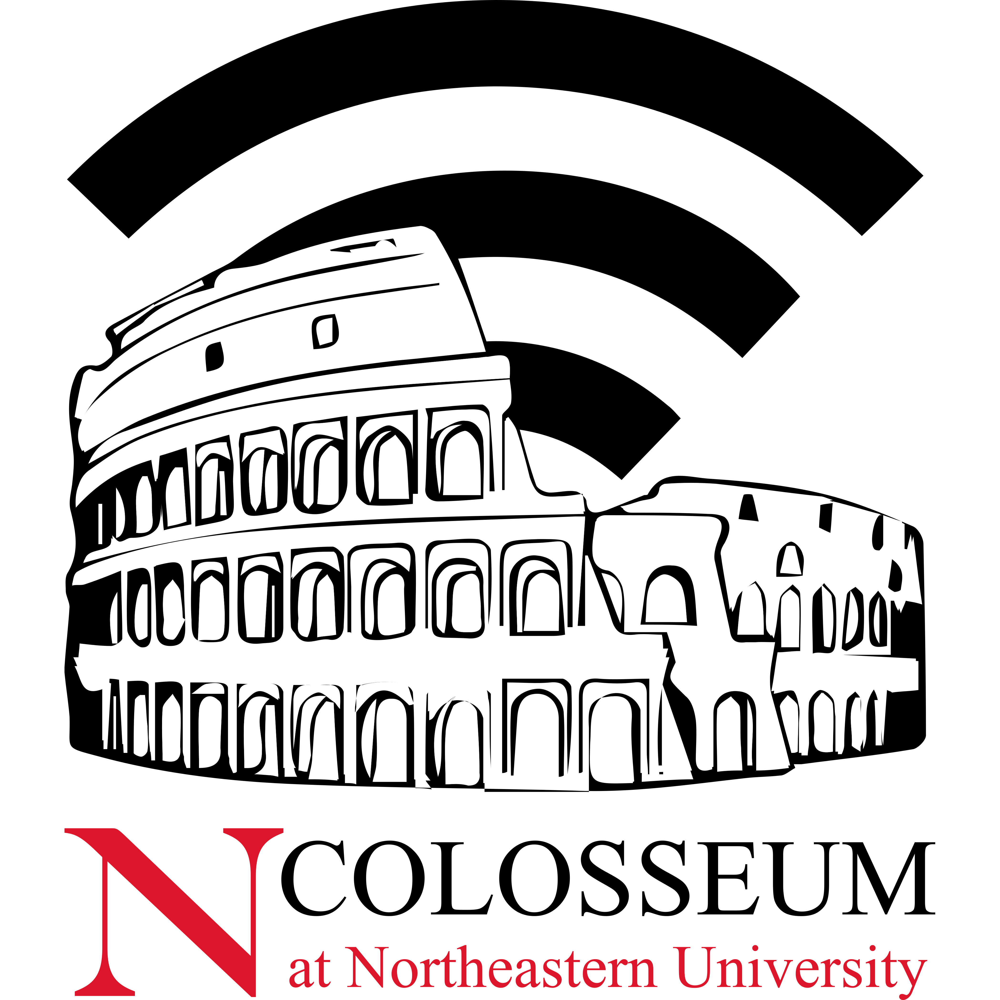

===================================
Colosseum Wireless Network Emulator
===================================

.. toctree::
   :maxdepth: 2
   :caption: Contents:

   about
   features
   faq
   getting_started/index
   tutorials/index
   wiki/index
   scenarios/index
   faq/index
   architecture/index
   reservations/index

Overview
--------

Colosseum is the world's largest RF emulator designed to support research and development of large-scale, next generation radio network technologies in a repeatable and highly configurable RF environment. It combines 128 Standard Radio Nodes (SRNs) with a Massive digital Channel Emulator (MCHEM) backed by an extensive FPGA routing fabric.

Quickstart
---------

* :doc:`Learn more about Colosseum <about>`
* :doc:`Explore available features <features>`
* :doc:`Get started with Colosseum <getting_started>`
* :doc:`Browse RF scenarios <scenarios/index>`
* :doc:`Review frequently asked questions <faq>`

.. note::
   If you are interested in becoming a Colosseum user, you can request a new team and account via the `signup form <https://docs.google.com/forms/d/e/1FAIpQLScHZ7gNyO4TB8b2xXPnbvPCSzGv22i0NREQ7p2XZyhF-dNQWA/viewform>`_
