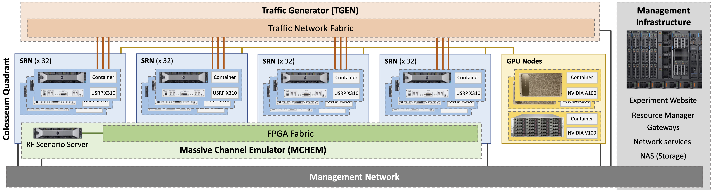

===================================
Colosseum Wireless Network Emulator
===================================

Colosseum is the world's largest RF emulator designed to support research and development of large-scale, next generation radio network technologies in a repeatable and highly configurable RF environment. It combines 128 Standard Radio Nodes (SRNs) with a Massive digital Channel Emulator (MCHEM) backed by an extensive FPGA routing fabric.

Colosseum is remotely accessible to users and operates 24/7/365, with resources reservable through a simple web interface.

Hardware Architecture
---------------------

Each Standard Radio Node (SRN) provides a platform for Software Defined Radio and Machine Learning applications with two key hardware components:

* A Dell R730 Server with an NVIDIA K40M GPU
* An Ettus Research USRP X310 Software-defined Radio equipped with a XILINX Kintex 7 FPGA

The Massive Channel Emulator (MCHEM) facilitates real-world wireless RF channel emulation between the SRNs and can emulate fading, multipath, and other effects for up to 256 x 256 independently customizable channels. This architecture enables large scale RF testing with up to 256 independent radio nodes, each with powerful computational capabilities.

   Colosseum architecture showing the interconnection between SRNs and MCHEM

RF Emulation Capabilities
-------------------------

Colosseum offers comprehensive RF emulation features including:

* Emulation of multiple operational environments including a 1 sq. km open field, dense urban cities, suburban shopping malls, deserts, or custom scenarios
* Real-time multipath and fading effects with high-fidelity ray-tracing
* Full-stack repeatable environment (from RF to application layer)
* Large scale testing with up to 256 radio nodes and 256x256 configurable channels

Container Environment
---------------------

Users operate within a containerized environment that provides flexibility and customization options:

* Preconfigured and ready-to-use LXC containers for basic testing
* User-customizable containers for developing and implementing specialized radio code
* Custom container images can be uploaded to Colosseum servers
* Options to load default or customized containers onto SRNs during reserved sessions

Supported Technologies
----------------------

Colosseum supports research across a wide range of wireless technologies:

* Cellular networks (4G, 5G)
* WiFi (802.11ac, 802.11ax)
* IoT protocols
* MIMO and beamforming
* Cognitive radio systems
* Dynamic spectrum access
* Edge computing and cloud RAN
* Machine learning for wireless communications

Resource Allocation
-------------------

Users have access to:

* High-performance computing (Dell R730 Servers, NVIDIA GPUs)
* Professional SDR hardware (Ettus X310)
* Comprehensive RF channel emulation via MCHEM
* Shared network-attached storage for experiment data
* Pre-configured container environments

Experimentation Options
-----------------------

Emulation jobs can be conducted in two ways:

* **Interactive sessions**: Manually control experiments during scheduled reservation times
* **Batch jobs**: Set up experiments to run automatically according to predefined instructions

Getting Started
---------------

* :doc:`Get started with Colosseum <getting_started/index>`
* :doc:`Browse RF scenarios <scenarios/index>`
* :doc:`Review frequently asked questions <faq/index>`

.. note::
   If you are interested in becoming a Colosseum user, you can request a new team and account via the `signup form <https://docs.google.com/forms/d/e/1FAIpQLScHZ7gNyO4TB8b2xXPnbvPCSzGv22i0NREQ7p2XZyhF-dNQWA/viewform>`_

.. toctree::
   :maxdepth: 2
   :caption: Additional Resources:

   getting_started/index
   tutorials/index
   scenarios/index
   faq/index
   architecture/index
   reservations/index
   srn/index
   container_mgmt/index
   radio_api_traffic/index
   news_announcements/index
